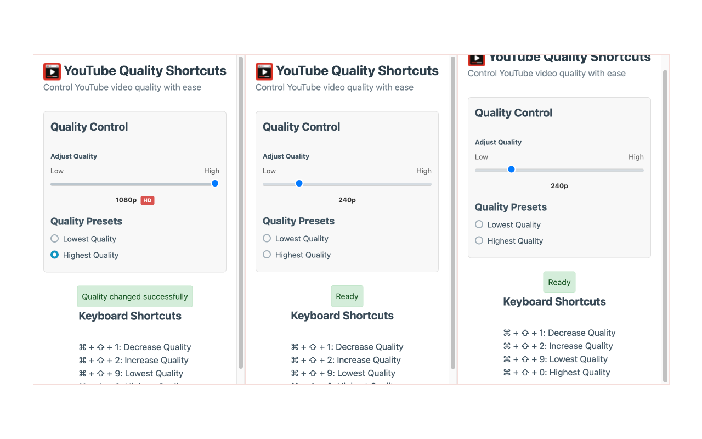

# YouTube Quality Shortcuts

## Overview

Control YouTube video quality with keyboard shortcuts or an intuitive slider interface.

Introducing a straightforward and powerful Chrome extension that transforms the way you watch videos on YouTube. Our tool is all about giving you control over video quality using either keyboard shortcuts or our new visual slider interface. Whether you're dealing with a slow connection or just want the best quality, our extension makes it effortless.

## Two Ways to Control Video Quality

### Visual Slider Interface

Our extension provides an intuitive slider interface that lets you:
- Adjust quality visually with a simple slider control
- See your current quality setting at a glance
- Quickly select the highest or lowest quality with radio buttons
- Monitor quality changes in real-time

### Keyboard Shortcuts

#### On Windows/Linux:

- **Ctrl + Shift + 1**: Decrease video quality
- **Ctrl + Shift + 2**: Increase video quality
- **Ctrl + Shift + 9**: Set to lowest quality
- **Ctrl + Shift + 0**: Set to highest quality

#### On Mac:

- **Command + Shift + 1**: Decrease video quality
- **Command + Shift + 2**: Increase video quality
- **Command + Shift + 9**: Set to lowest quality
- **Command + Shift + 0**: Set to highest quality

## Seamless Integration

Our extension feels like a natural part of your YouTube experience. It's unobtrusive, easy to use, and doesn't interfere with your browsing. The quality indicator uses YouTube's native on-screen display for a consistent experience.

## Privacy and Efficiency

We know how important your online privacy is. Our extension respects that – no tracking, no data collection, just the functionality you need.