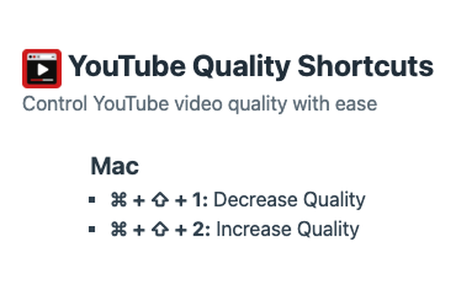

# YouTube Quality Shortcuts

## Overview

Control You Tube video quality with keyboard shortcuts.

Introducing a straightforward and powerful Chrome extension that transforms the way you watch videos on YouTube. Our tool is all about giving you control over video quality with just a couple of shortcuts. Whether you're dealing with a slow connection or just want the best quality, our extension makes it effortless.

**Simple and Effective Shortcuts:**

### On Windows:

- Control + Shift + 1: Decrease video quality.
- Control + Shift + 2: Increase video quality.

### On Mac:

- Command + Shift + 1: Decrease video quality.
- Command + Shift + 2: Increase video quality.

**Seamless Integration:**

Our extension feels like a natural part of your YouTube experience. It’s unobtrusive, easy to use, and doesn't interfere with your browsing.

**Privacy and Efficiency:**

We know how important your online privacy is. Our extension respects that – no tracking, no data collection, just the functionality you need.